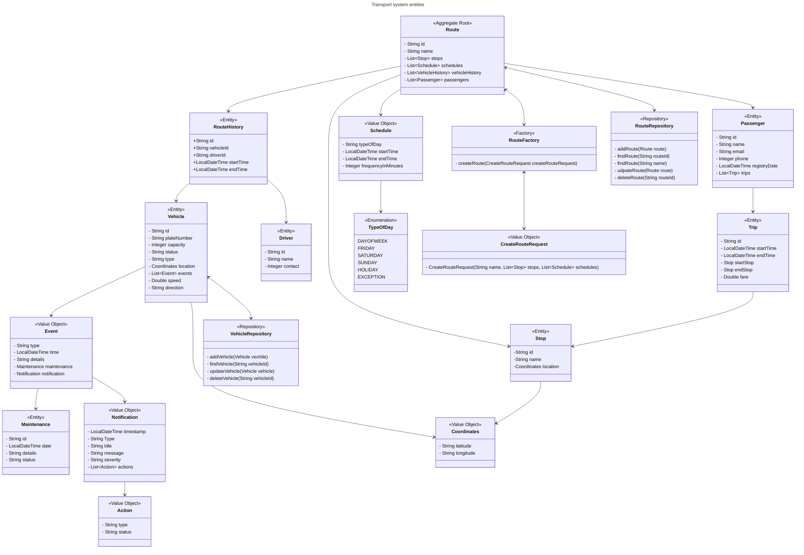

### Client requirements

Necesidades de datos de empresa:

    -Queremos saber qué trayectos están más hasta arriba de gente
    -Aplicación para gestionar sistema de rutas
    -Saber conductor y vehículo asignados a una ruta
    -Historial de conductor y vehículo
    -Consultar paradas de una ruta y modificarlas
    -Historial de incidencias del vehículo
    -Ver ubicación en tiempo real de los vehículos
    -Consultar y modificar horarios de una ruta
    -Que los conductores puedan introducir eventos
    -Según el tipo de evento, deberían enviarse notificaciones a los clientes
    -Poder asignar vehículos a una ruta
    -Poder asignar conductores a una ruta y un horario

Necesidades de aplicación para clientes:

    -Calculador de costo de viajes
    -Queremos que la gente busque horarios en una app
    -Ver notificaciones de retrasos

#### Model

