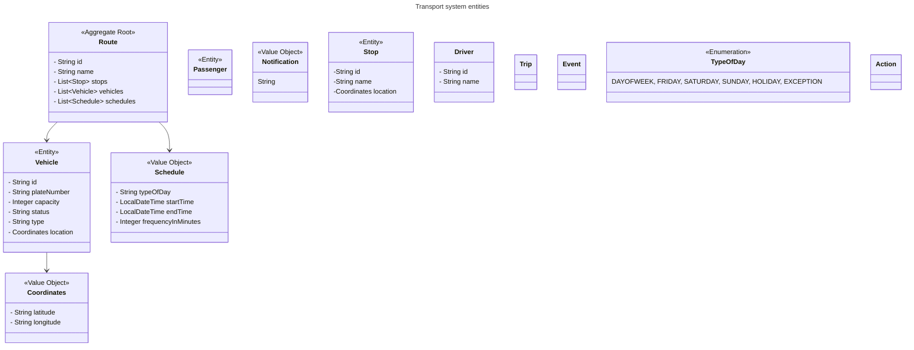

#### Model

```mermaid
---
title: Transport system entities
---
classDiagram
    class Route{
        <<Aggregate Root>>
        - String id
        - String name
        - List~Stop~ stops
        - List~Vehicle~ vehicles
        - List~Schedule~ schedules
    }
    
    class Vehicle{
        <<Entity>>
        - String id
        - String plateNumber
        - Integer capacity
        - String status
        - String type
        - Coordinates location
    }
    
    class Passenger{
        <<Entity>>
    }

    class Notification{
        <<Value Object>>
        String 
    }
    
    class Stop{
        <<Entity>>
        -String id
        -String name
        -Coordinates location
    }
    
    class Driver{
        - String id
        - String name
        
    }
    
    Queremos saber qué trayectos están más hasta arriba de gente
    Queremos que la gente busque horarios en una app
    
    
    class Trip {
        
    }  
    
    
    class Event{
        
    }
    
    class Coordinates{
        <<Value Object>>
        - String latitude
        - String longitude
    }
    
    class Schedule {
        <<Value Object>>
        - String typeOfDay
        - LocalDateTime startTime
        - LocalDateTime endTime
        - Integer frequencyInMinutes
    }  
    
    class TypeOfDay {
        <<Enumeration>>
        DAYOFWEEK, FRIDAY, SATURDAY, SUNDAY, HOLIDAY, EXCEPTION
    }  
    
    class Action {
        
    }

    Route --> Schedule
    Route --> Vehicle
    Vehicle --> Coordinates


```